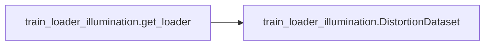
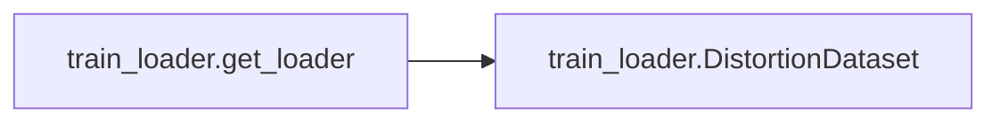

# Key Objects

[_Documentation generated by Documatic_](https://www.documatic.com)

<!---Documatic-section-train_loader_illumination.get_loader-start--->
## train_loader_illumination.get_loader

<!---Documatic-section-get_loader-start--->


### Object Calls

* train_loader_illumination.DistortionDataset

<!---Documatic-block-train_loader_illumination.get_loader-start--->
<details>
	<summary><code>train_loader_illumination.get_loader</code> code snippet</summary>

```python
def get_loader(distorted_image_dir, corrected_image_dir, batch_size):
    transform = transforms.Compose([transforms.Normalize((0.5, 0.5, 0.5), (0.5, 0.5, 0.5))])
    dataset = DistortionDataset(distorted_image_dir, corrected_image_dir, transform)
    data_loader = data.DataLoader(dataset=dataset, batch_size=batch_size, shuffle=True, drop_last=True)
    return data_loader
```
</details>
<!---Documatic-block-train_loader_illumination.get_loader-end--->
<!---Documatic-section-get_loader-end--->

# #
<!---Documatic-section-train_loader_illumination.get_loader-end--->

<!---Documatic-section-train_loader.DistortionDataset-start--->
## train_loader.DistortionDataset

<!---Documatic-section-DistortionDataset-start--->
<!---Documatic-block-train_loader.DistortionDataset-start--->
<details>
	<summary><code>train_loader.DistortionDataset</code> code snippet</summary>

```python
class DistortionDataset(data.Dataset):

    def __init__(self, patch_dir, flow_dir, global_dir, transform):
        self.local_img_paths = []
        self.flow_paths = []
        self.global_img_paths = []
        for fs in os.listdir(patch_dir):
            self.local_img_paths.append(os.path.join(patch_dir, fs))
        for fs in os.listdir(flow_dir):
            self.flow_paths.append(os.path.join(flow_dir, fs))
        for fs in os.listdir(global_dir):
            self.global_img_paths.append(os.path.join(global_dir, fs))
        self.local_img_paths.sort()
        self.flow_paths.sort()
        self.global_img_paths.sort()
        self.transform = transform

    def __getitem__(self, index):
        """Reads an image from a file and preprocesses it and returns."""
        local_img_path = self.local_img_paths[index]
        flow_path = self.flow_paths[index]
        global_img_path = self.global_img_paths[index]
        loal_img = skimage.io.imread(local_img_path)
        global_img = skimage.io.imread(global_img_path)
        flow = np.load(flow_path)
        flow = flow.astype(np.float32)
        if self.transform is not None:
            loal_img = self.transform(loal_img)
            global_img = self.transform(global_img)
        return (loal_img, flow, global_img)

    def __len__(self):
        """Returns the total number of image files."""
        return len(self.local_img_paths)
```
</details>
<!---Documatic-block-train_loader.DistortionDataset-end--->
<!---Documatic-section-DistortionDataset-end--->

# #
<!---Documatic-section-train_loader.DistortionDataset-end--->

<!---Documatic-section-train_loader.get_loader-start--->
## train_loader.get_loader

<!---Documatic-section-get_loader-start--->


### Object Calls

* train_loader.DistortionDataset

<!---Documatic-block-train_loader.get_loader-start--->
<details>
	<summary><code>train_loader.get_loader</code> code snippet</summary>

```python
def get_loader(patch_dir, flow_dir, global_dir, batch_size):
    transform = transforms.Compose([transforms.ToTensor(), transforms.Normalize((0.5, 0.5, 0.5), (0.5, 0.5, 0.5))])
    dataset = DistortionDataset(patch_dir, flow_dir, global_dir, transform)
    data_loader = data.DataLoader(dataset=dataset, batch_size=batch_size, shuffle=True, drop_last=True)
    return data_loader
```
</details>
<!---Documatic-block-train_loader.get_loader-end--->
<!---Documatic-section-get_loader-end--->

# #
<!---Documatic-section-train_loader.get_loader-end--->

<!---Documatic-section-model_illNet.illNet-start--->
## model_illNet.illNet

<!---Documatic-section-illNet-start--->
<!---Documatic-block-model_illNet.illNet-start--->
<details>
	<summary><code>model_illNet.illNet</code> code snippet</summary>

```python
class illNet(nn.Module):

    def __init__(self):
        super(illNet, self).__init__()
        self.block1 = nn.Sequential(nn.Conv2d(3, 64, kernel_size=3, padding=1), nn.BatchNorm2d(64), nn.ReLU())
        self.block2 = ResidualBlock(64)
        self.block3 = ResidualBlock(64)
        self.block4 = ResidualBlock(64)
        self.block5 = ResidualBlock(64)
        self.block6 = ResidualBlock(64)
        self.block9 = nn.Sequential(nn.Conv2d(64, 64, kernel_size=3, padding=1), nn.BatchNorm2d(64), nn.ReLU(), nn.Conv2d(64, 64, kernel_size=3, padding=1), nn.BatchNorm2d(64), nn.ReLU(), nn.Conv2d(64, 3, kernel_size=3, padding=1))

    def forward(self, x):
        block1 = self.block1(x)
        block2 = self.block2(block1)
        block3 = self.block3(block2)
        block4 = self.block4(block3)
        block5 = self.block5(block4)
        block6 = self.block6(block5)
        block9 = self.block9(block1 + block6)
        return block9
```
</details>
<!---Documatic-block-model_illNet.illNet-end--->
<!---Documatic-section-illNet-end--->

# #
<!---Documatic-section-model_illNet.illNet-end--->

<!---Documatic-section-train_loader_illumination.DistortionDataset-start--->
## train_loader_illumination.DistortionDataset

<!---Documatic-section-DistortionDataset-start--->
<!---Documatic-block-train_loader_illumination.DistortionDataset-start--->
<details>
	<summary><code>train_loader_illumination.DistortionDataset</code> code snippet</summary>

```python
class DistortionDataset(data.Dataset):

    def __init__(self, distorted_image_dir, corrected_image_dir, transform):
        self.distorted_image_paths = []
        self.corrected_image_paths = []
        for fs in os.listdir(distorted_image_dir):
            self.distorted_image_paths.append(os.path.join(distorted_image_dir, fs))
        for fs in os.listdir(corrected_image_dir):
            self.corrected_image_paths.append(os.path.join(corrected_image_dir, fs))
        self.distorted_image_paths.sort()
        self.corrected_image_paths.sort()
        self.transform = transform

    def __getitem__(self, index):
        """Reads an image from a file and preprocesses it and returns."""
        distorted_image_path = self.distorted_image_paths[index]
        corrected_image_path = self.corrected_image_paths[index]
        distorted_image = skimage.io.imread(distorted_image_path)
        distorted_image = distorted_image.astype(np.float32) / 255.0
        distorted_image = torch.Tensor(distorted_image).permute(2, 0, 1)
        corrected_image = skimage.io.imread(corrected_image_path)
        corrected_image = corrected_image.astype(np.float32) / 255.0
        corrected_image = torch.Tensor(corrected_image).permute(2, 0, 1)
        tfImg = self.transform(distorted_image)
        return (tfImg, corrected_image)

    def __len__(self):
        """Returns the total number of image files."""
        return len(self.distorted_image_paths)
```
</details>
<!---Documatic-block-train_loader_illumination.DistortionDataset-end--->
<!---Documatic-section-DistortionDataset-end--->

# #
<!---Documatic-section-train_loader_illumination.DistortionDataset-end--->

[_Documentation generated by Documatic_](https://www.documatic.com)